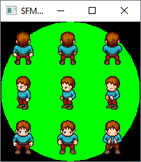

Mario
=====
A Mario game clone

Setup
-----
Run `/SetupWorkspace.bat` which:
* cleans
* copies Git hooks
* runs CMake to generate make/project files
* builds.

> Visual Studio 14 (2015) is the default CMake generator.  You can change this in `/Depot/BuildScripts/Config.bat`.

Subsequent Builds
-----------------
* To run CMake to generate make/project files and do a build, run `/GenerateAndBuild.bat`.
* To just run CMake, run `/Generate.bat`.
* To clean, run `/Clean.bat`.

Running
--------------------
1. Change the working directory to the location of the executable, `Target\Game\{config}`. In Visual Studio, do this by setting the project properties `Debugging > Working Directory` to `$(OutputPath)`.
Run GettingStarted.exe.
2. Run `Game.exe`.
